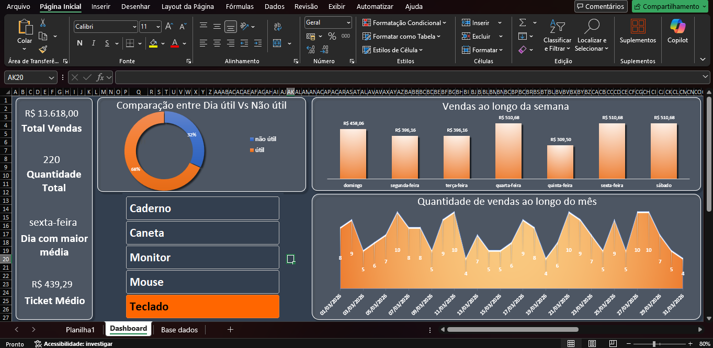

# monthly-sales-analysis-excel
# Sales Analysis Dashboard (Excel)

This project is an interactive sales dashboard built in Excel to explore how sales behave throughout the month.

---

## Overview

Using Excel tools like Pivot Tables, slicers, and charts, I created a dashboard that allows analysis by:

- Day of the week  
- Product  
- Category  
- Time (monthly evolution)  

---

## Tools Used

- Microsoft Excel  
- Pivot Tables  
- Slicers  
- Charts  

---

## Key Insights

- Sales are generally stronger on weekends  
- The beginning of the month has lower performance  
- Tech products show more consistent results  
- Product bundles can increase revenue  

---

## Business Ideas

- Run promotions at the beginning of the month  
- Focus marketing on weekends  
- Offer product bundles to increase ticket value  

---

## Dashboard Preview

---

## Files

- Dashboard-Sales.xlsx  
- Dashboard.png  

---

## Next Steps

I plan to expand this project using Python to automate the data and improve the analysis.
